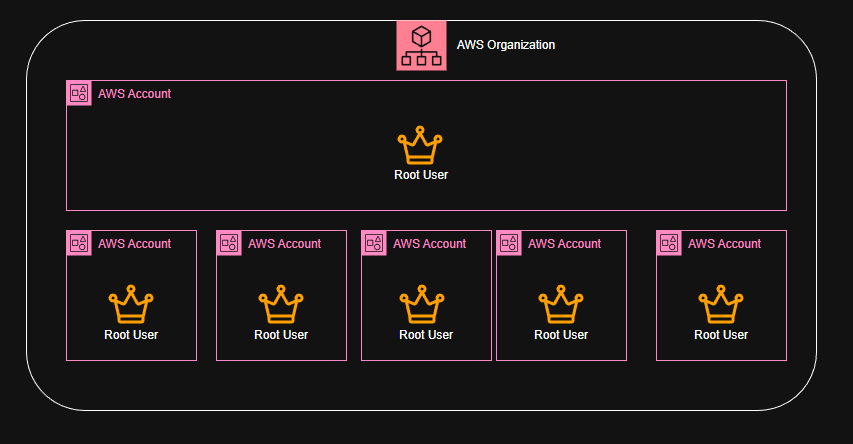

# AWS Organization

With AWS Organization, you can centrally manage and govern your environment as you grow and scale your AWS resources. You can create multiple AWS accounts and group them into organizational units (OUs) to apply policies and manage billing.

#### :key: Key Features

:fire: **Centralized Management**: Manage multiple AWS accounts from a single master account.

:fire: **Organizational Units (OUs)**: Group accounts into OUs for easier management and policy application.

:fire: **Service Control Policies (SCPs)**: Apply policies to OUs or individual accounts to control permissions.

:fire: **Consolidated Billing**: Combine billing for all accounts in your organization to take advantage of volume pricing discounts.

:fire: **Automated Account Creation**: Programmatically create and manage AWS accounts using the AWS Organizations API.

#### :ladder: Use Cases

**Multi-Account Strategy**: Isolate workloads, environments, or teams by creating separate AWS accounts.

**Policy Enforcement**: Ensure compliance by applying SCPs across your organization.

**Cost Management**: Track and manage costs across multiple accounts with consolidated billing.

**Scalability**: Easily add new accounts as your organization grows.

**Sharing Resources**: Share resources like AWS Transit Gateway or AWS License Manager across accounts.

**Security and Compliance**: Implement security best practices by isolating sensitive workloads in separate accounts.
