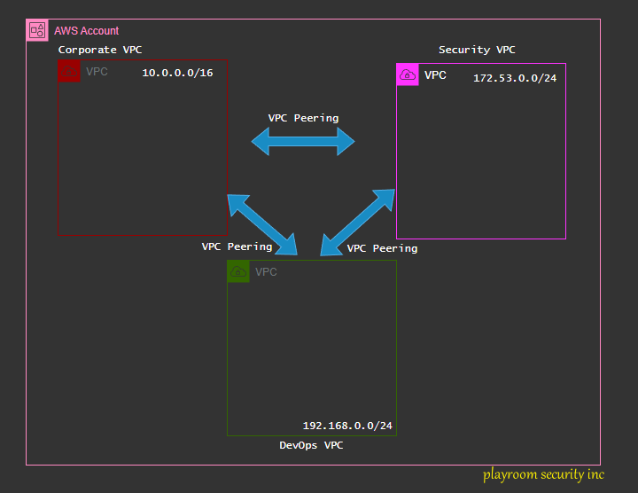
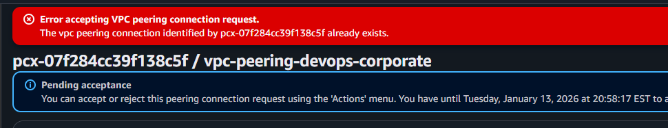

??? info ":department_store: Fictitious Cloud Requirement Document"
    Company Overview

    🔹 Company Name: NovaCart Technologies

    🔹 Industry: Global E-commerce & Logistics

    🔹 Company Size: ~1,200 employees

    🔹 Regions of Operation: North America, Europe, Asia-Pacific

    NovaCart is a rapidly growing e-commerce platform that supports millions of daily users. The company is migrating from an on-premises data center to AWS to improve scalability, security, and global availability.

??? question ":fire_engine: Cloud Engineering Task"
    You are the Cloud Engineer responsible for designing the AWS network connectivity model.

    Your Responsibilities:

    `Consider VPC Peering for NovaCart’s use case`

    Explain:

    - How each option works

    - Their advantages and limitations

    - Impact on scalability, security, and operations

    - Recommend one solution and justify why it best meets NovaCart’s requirements.

### VPC Peering


Check out the Official AWS Documentation for more indepth information on `VPC Peering`
<div class="iframely-embed"><div class="iframely-responsive" style="height: 140px; padding-bottom: 0;"><a href="https://docs.aws.amazon.com/vpc/latest/peering/working-with-vpc-peering.html" data-iframely-url="https://iframely.net/ssJrtKR2?theme=dark"></a></div></div><script async src="https://iframely.net/embed.js"></script>

To enable VPC peering, we would have to create two or more VPC (Virtual Private Clouds) in your AWS Account.

### Steps to create a VPC using the AWS Console

#### 📢 Step 1

Login to your AWS Account as an IAM User and go to the search menu. Search for `VPC`

#### 🔊 Step 2

On the VPV Dashboard glade. Click on `Create VPC`.


#### 📯 Step 3
- Select `VPC only` if not automatically selected.
- Fill in the `Name tag` option.
- Fill in the IPv4 CIDR (You can use those ones in the image above)
- Leave IPv6 CIDR block as `No IPv6 CIDR block`.
- Leave the `Tenancy` as `Default`.
- Leave the `VPC encryption vontrol($)` as __None__.
- Click `Create VPC` at the bottom right-hand corner for AWS to deploy the VPC.

Repeat same process as above for the second VPC, but be sure to change the `IPv4 CIDR` option. That is mandatory.

#### 🔔 Step 4
View the already created `VPC` in your `VPC Dashboard`.


### Creating a VPC via AWS CLI

!!! tip "**AWS VPC create**"

    ```bash
    aws ec2 create-vpc \
        --cidr-block 10.0.0.0/16 \
        --tag-specifications 'ResourceType=vpc,Tags=[{Key=Name,Value=MyVPC}]'
    ```

Since we will be creating three (3) VPCs, I wouldn't expect you run this command three times. It is just cumbersome and tiring. Let's script this using `Bash`.

For simplicity, I will be creating three (3) VPC with incremental IPv4 CIDR like `10.0.0.0/16`, `10.1.0.0/16` and so on.

!!! tip "**Sample Bash Script**"

    ```bash
    #!/usr/bin/env bash

    set -euo pipefail

    # Set variables
    REGION="us-east-1"
    BASE_CIDR="10"
    INDEX=0

    VPC_NAMES=("prod-vpc" "staging-vpc" "dev-vpc")

    for VPC_NAME in "${VPC_NAMES[@]}"; do
    CIDR_BLOCK="$BASE_CIDR.$INDEX.0.0/16"

    echo "Creating VPC: $VPC_NAME ($CIDR_BLOCK)"

    VPC_ID=$(aws ec2 create-vpc \
        --region "$REGION" \
        --cidr-block "$CIDR_BLOCK" \
        --tag-specifications "ResourceType=vpc,Tags=[{Key=Name,Value=$VPC_NAME}]" \
        --query 'Vpc.VpcId' \
        --output text
    )

    echo "VPC created: $VPC_ID"

    echo "Enabling DNS support for $VPC_ID"
    aws ec2 modify-vpc-attribute \
        --region "$REGION" \
        --vpc-id "$VPC_ID" \
        --enable-dns-support

    echo "Enabling DNS hostnames for $VPC_ID"
    aws ec2 modify-vpc-attribute \
        --region "$REGION" \
        --vpc-id "$VPC_ID" \
        --enable-dns-hostnames

    ((INDEX++))
    done

    ```

### Creating VPC Peered network between all three VPCs.

Back to the AWS Console, using the Search feature, search for `VPC`. 

- On the left options, search for `Peering connections`. and click `Create peering connection`.

- Choose a `Name` for the peering connection (optional). I will use `vpc-peering-corporate-security`.
- Select a VPC to peer with. In my case I will choose the `VPC corporate` VPC.
- Since all the three (3) VPC resides in one AWS account, I will choose `My account` under the `Select another VPC to peer with`.
- Also I deployed all three (3) VPCs in `us-east-1` so I will leave it as default.
- The Accepter VPC ID would be the `VPC Security`.

Since this is a demo, and we would need to aceept the `in-coming peering request`. There should be a `Pending acceptance` from the just created vpc peering.

- Click the `Actions` drop-down and Select `Accept request`.
- After reviewing the details of the peering request, click `Accept request`.

!!! failure "**Complete the remaining vpc peering**"
    There should be no over-laping IPv4 CIDR ranges between two VPC, else it would fail 

!!! example "**My VPC Peering setup**"
    My VPC peering setup would be:

    playroom-security vpc --> playroom devops vpc

    playroom-security vpc --> playroom corporate vpc

    playroom-devops vpc --> playroom corporate vpc

### Troubleshoot

If you get this error: `Error accepting VPC peering connection request`. It is because there is an already establised vpc peering between the two (2) VPCs.

### Using the AWS CLI to create a VPC peering

!!! example "**Creating VPC Peering**"
    In the same AWS account, same region.

    ```bash
    aws ec2 create-vpc-peering-connection \
        --vpc-id vpc-1a2b3c4d \ # VPC ID for the Requester
        --peer-vpc-id vpc-11122233 \ # VPC ID for the Accepter
        --peer-region us-east-1
    ```

    In another AWS account

    ```bash
    aws ec2 create-vpc-peering-connection \
        --vpc-id vpc-1a2b3c4d \ # VPC ID for the Requester
        --peer-vpc-id vpc-11122233 \ # VPC ID for the Accepter
        --peer-owner-d 1234567999 \ AWS account ID for the Accepter
        --peer-region us-east-1 

    ```

    In the same account, different region.

    ```bash
    aws ec2 create-vpc-peering-connection \
        --vpc-id vpc-1a2b3c4d \ # VPC ID for the Requester
        --peer-vpc-id vpc-11122233 \ # VPC ID for the Accepter
        --peer-region us-east-1
    ```

#### :fontawesome-solid-route: Routing (VPC peered networks)

The next step is to create a route table entry that will set the `Destination` address and our VPC peering connection id.

:rocket: Go to the VPC Console.

:rocket: Click on `Route tables` on the left hand menu options.

:rocket: Expand the VPC tab to be sure you are selecting the right VPC.

:rocket: Select any of the VPCs by clicking on their `Route table ID`.

:rocket: On the Route tab, click `Edit routes` towards the far right.

:rocket: Click on `Add route`.

:rocket: Since the selected VPC is peered to both other VPCs. On the `Target` option select `Peering Connection`.

:rocket: A downdown would appear starting with `pcx-` click on the drop down and select the which peer connection you want to configure the route for.

:rocket: Add the `Destination` address to the Destination option.

!!! warning "**Destination Address**"
    The destination address would always be the REVERSE between the Requestor VPC and the Accepter VPC.

    !!! failure "__Please note__"
        If you chose the **Requester VPC** to configure a Route table, then the Destination address should always be the **ACCEPTER VPC**, and visa versa.


!!! note
    Work on the rest of the peered connected route tables

__You should something like this at the end of this demo.__


## ✅ **Advantages of AWS VPC Peering**

!!! note
    !!! Success
        - Simple & fast to set up.
        - Direct, point-to-point connectivity between two VPCs.

    !!! Success
        - Low latency & high bandwidth
        - Traffic stays on the AWS backbone (no internet, no NAT).

    !!! Success
        - Cost-effective
        - No hourly charge—only standard data transfer costs.

    !!! Success
        - Secure by default
        - No public IPs required; traffic remains private.

    !!! Success
        - Cross-account & cross-region support
        - Peer VPCs across AWS accounts and regions.


## ❌ **Limitations of AWS VPC Peering**

!!! question
    !!! failure 
        No transitive routing
        
        VPC A ↔ VPC B ↔ VPC C does not allow A ↔ C traffic.

    !!! failure 
        CIDR blocks must not overlap.

        Overlapping IP ranges prevent peering.

    !!! failure 
        Poor scalability.

        Mesh architectures become hard to manage as VPC count grows.

    !!! failure 
        Manual route table management.

        Routes must be added explicitly for each peered VPC.

    !!! failure 
        No centralized networking control.

        Each peering connection is managed individually.

## 🧠 **When to Use VPC Peering**

!!! Tip
    ✔ Small number of VPCs

    ✔ Simple, one-to-one connectivity
    
    ✔ Low-latency, private communication

## 👍 Recommendations

!!! Tip
    👉 AWS Transit Gateway


