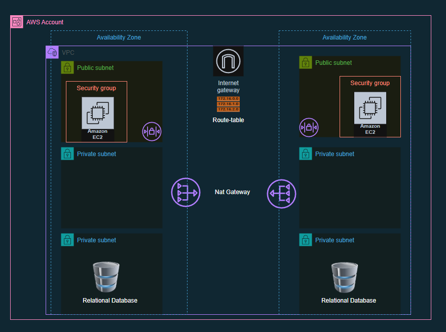
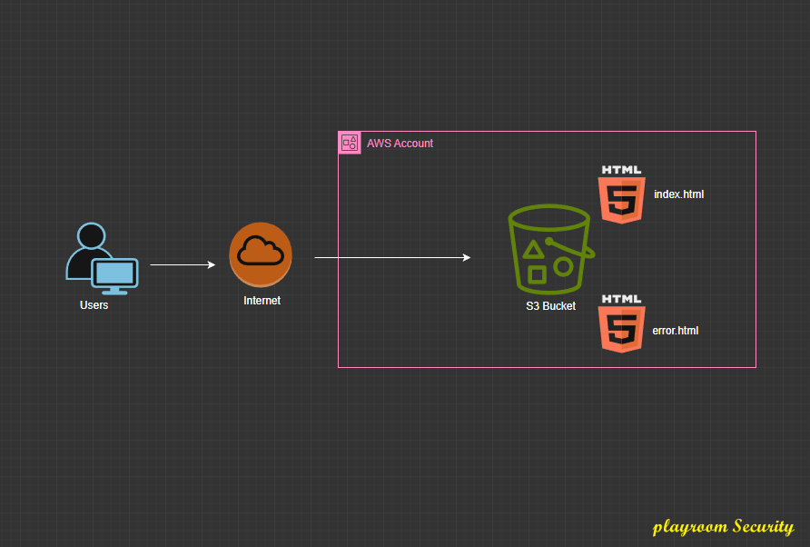
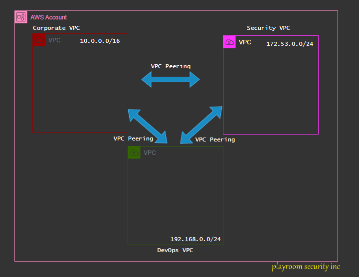

# Coming soon !!

*  :octicons-arrow-right-24: [**AWS Project: Three Tier Architecture**](basic/three-tier-architecture.md)
*  :octicons-arrow-right-24: [**AWS Project: Amazon S3 Static Website**](basic/static-website-hosting.md)
*  :octicons-arrow-right-24: [**AWS Project: VPC Peering**](Intermediate/vpc-peering.md)
* [AWS Project](index.md) :octicons-arrow-right-24: [**AWS Project: Secure Multi-Tenant SaaS Platform (Zero-Trust)**](index.md)
* [AWS Project](index.md) :octicons-arrow-right-24: [**AWS Project: Event-Driven Order Processing System (Enterprise-Grade)**](index.md)
* [AWS Project](index.md) :octicons-arrow-right-24: [**AWS Project: Highly Available Web Application (Multi-AZ + DR)**](index.md)
* [AWS Project](index.md) :octicons-arrow-right-24: [**AWS Project: Cloud-Native CI/CD Platform (DevSecOps)**](index.md)
* [AWS Project](index.md) :octicons-arrow-right-24: [**AWS Project: Real-Time Log Analytics & Security Monitoring Platform**](index.md)
* [AWS Project](index.md) :octicons-arrow-right-24: [**AWS Project: Serverless Data Lake & Analytics Platform**](index.md)
* [AWS Project](index.md) :octicons-arrow-right-24: [**AWS Project: Cost Optimization & Usage Intelligence Dashboard**](index.md)
* [AWS Project](index.md) :octicons-arrow-right-24: [**AWS Project: Secure Hybrid Cloud Connectivity (Advanced Networking)**](index.md)
