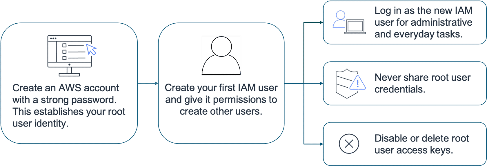

## **AWS root user**

The AWS root user is the primary account holder in an AWS environment and has unrestricted access to all resources and services within the account. This user is critical for managing the account and performing administrative tasks. To facilitate access, the root user has two distinct sets of credentials.

## **Username/Password Combination**
The first set of credentials consists of the email address and password used during the account creation process. These credentials are primarily used to log in to the AWS Management Console, a web-based interface that allows users to manage AWS resources visually and interactively.

## **Access Keys**
The second set of credentials is known as access keys. Access keys are composed of an access key ID and a secret access key. 

These are used for programmatic access, enabling the root user to interact with AWS services through the AWS Command Line Interface (CLI) or by making direct API calls. This programmatic access is particularly useful for automating tasks, integrating AWS services into applications, or managing resources without relying on the web interface.

It is important to note that the root user has full administrative privileges, so securing both sets of credentials is critical to prevent unauthorized access to your AWS account. Best practices recommend minimizing the use of the root user and instead creating IAM users or roles with limited permissions for day-to-day operations.

### **AWS root user best practices:**

To ensure the safety of the root user, AWS has provided the below best

- [x] Choose a strong and complex password for the root user
- [x] Enable multi-factor authentication (MFA)
- [x] Never share root user credentials
- [X] Disable or delete the access keys associated with the root user
- [x] Create an IAM User foradministrative tasks

