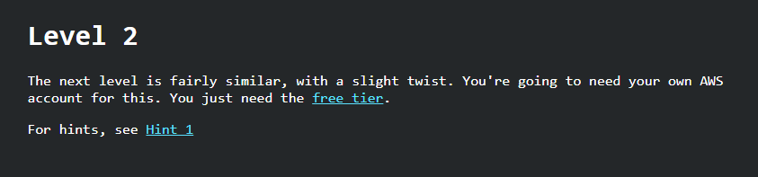

# Flaws.cloud Level 2

Status: Done
Assign: Dcyberguy



I already have my AWS account configured

If I tried to list the s3 bucket without credentials I get an error message.

```bash
aws s3 ls s3://level2-c8b217a33fcf1f839f6f1f73a00a9ae7.flaws.cloud --no-sign-request

An error occurred (AccessDenied) when calling the ListObjectsV2 operation: Access Denied

```

So I navigated to the AWS Console and added an IAM access keys to my existing IAM User.

Now I get the contents of the Flaws Cloud level 2

```bash
aws s3 ls s3://level2-c8b217a33fcf1f839f6f1f73a00a9ae7.flaws.cloud
2017-02-26 21:02:15      80751 everyone.png
2017-03-02 22:47:17       1433 hint1.html
2017-02-26 21:04:39       1035 hint2.html
2017-02-26 21:02:14       2786 index.html
2017-02-26 21:02:14         26 robots.txt
2017-02-26 21:02:15       1051 secret-e4443fc.html

```

Download the secret file and you will get access to Level 3

```bash
aws s3 cp s3://level2-c8b217a33fcf1f839f6f1f73a00a9ae7.flaws.cloud/secret-e4443fc.html .
download: s3://level2-c8b217a33fcf1f839f6f1f73a00a9ae7.flaws.cloud/secret-e4443fc.html to ./secret-e4443fc.html
❯ batcat secret-e4443fc.html
───────┬────────────────────────────────────────────────────────────────────────────────────────────────────────────────────────────────────
       │ File: secret-e4443fc.html
───────┼────────────────────────────────────────────────────────────────────────────────────────────────────────────────────────────────────
   1   │ <html>
   2   │     <head>
   3   │         <title>flAWS</title>
   4   │         <META NAME="ROBOTS" CONTENT="NOINDEX, NOFOLLOW">
   5   │         <style>
   6   │             body { font-family: Andale Mono, monospace; }
   7   │             :not(center) > pre { background-color: #202020; padding: 4px; border-radius: 5px; border-color:#00d000; 
   8   │             border-width: 1px; border-style: solid;} 
   9   │         </style>
  10   │     </head>
  11   │ <body 
  12   │   text="#00d000" 
  13   │   bgcolor="#000000"  
  14   │   style="max-width:800px; margin-left:auto ;margin-right:auto"
  15   │   vlink="#00ff00" link="#00ff00">
  16   │     
  17   │ <center>
  18   │ <pre >
  19   │  _____  _       ____  __    __  _____
  20   │ |     || |     /    ||  |__|  |/ ___/
  21   │ |   __|| |    |  o  ||  |  |  (   \_ 
  22   │ |  |_  | |___ |     ||  |  |  |\__  |
  23   │ |   _] |     ||  _  ||  `  '  |/  \ |
  24   │ |  |   |     ||  |  | \      / \    |
  25   │ |__|   |_____||__|__|  \_/\_/   \___|
  26   │ </pre>
  27   │ 
  28   │ <h1>Congrats! You found the secret file!</h1>
  29   │ </center>
  30   │ 
  31   │ 
  32   │ Level 3 is at <a href="http://level3-9afd3927f195e10225021a578e6f78df.flaws.cloud">http://level3-9afd3927f195e10225021a578e6f78df.f
       │ laws.cloud</a>
```