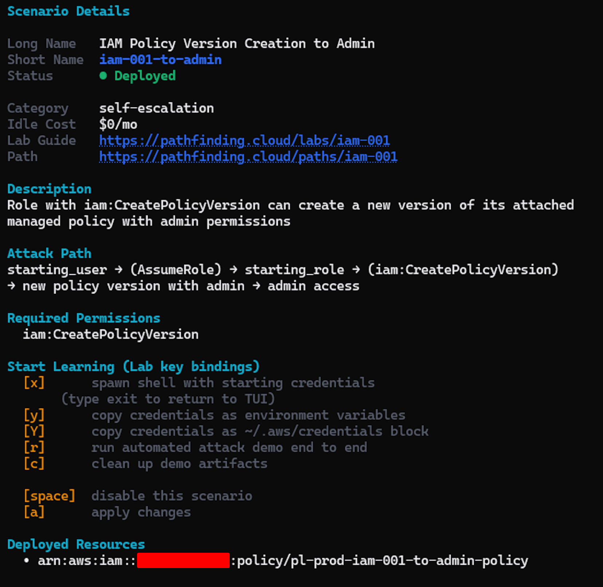

## Enumeration

```jsx
aws sts get-caller-identity --profile prod | jq
{
  "UserId": "AIDAVRUVSVUFNHTJC4YK3",
  "Account": "111111111111",
  "Arn": "arn:aws:iam::111111111111:user/pathfinder-prod"
}
```

### List Users

```jsx
ws iam list-users --profile prod | jq
{
  "Users": [
    {
      "Path": "/",
      "UserName": "pathfinder-prod",
      "UserId": "AIDAVRUVSVUFNHTJC4YK3",
      "Arn": "arn:aws:iam::111111111111:user/pathfinder-prod",
      "CreateDate": "2026-05-20T15:32:17+00:00"
    },
    {
      "Path": "/",
      "UserName": "pl-admin-user-for-cleanup-scripts",
      "UserId": "AIDAVRUVSVUFAJSU7GTBB",
      "Arn": "arn:aws:iam::111111111111:user/pl-admin-user-for-cleanup-scripts",
      "CreateDate": "2026-05-23T23:26:51+00:00"
    },
    {
      "Path": "/",
      "UserName": "pl-prod-iam-001-to-admin-starting-user",
      "UserId": "AIDAVRUVSVUFGBZ7VDAOJ",
      "Arn": "arn:aws:iam::111111111111:user/pl-prod-iam-001-to-admin-starting-user",
      "CreateDate": "2026-05-23T23:26:51+00:00"
    },
    {
      "Path": "/",
      "UserName": "pl-readonly-user-prod",
      "UserId": "AIDAVRUVSVUFNWG2GIZN3",
      "Arn": "arn:aws:iam::111111111111:user/pl-readonly-user-prod",
      "CreateDate": "2026-05-23T23:26:51+00:00"
    }
  ]
}
```

Here I have three(3) users: `pl-admin-user-for-cleanup-scripts`, `pl-prod-iam-001-to-admin-starting-user`and `pl-readonly-user-prod` users.

Our main focus would be: `pl-prod-iam-001-to-admin-starting-user`

User has an attached policy called `pl-prod-iam-001-to-admin-starting-user-policy`

```jsx
aws iam list-user-policies --user-name pl-prod-iam-001-to-admin-starting-user --profile prod
{
    "PolicyNames": [
        "pl-prod-iam-001-to-admin-starting-user-policy"
    ]
}
```

No attached policy

```jsx
 aws iam list-attached-user-policies --user-name pl-prod-iam-001-to-admin-starting-user --profile prod
{
    "AttachedPolicies": []
}
```

Not part of any groups either.

```jsx
aws iam list-groups-for-user --user-name pl-prod-iam-001-to-admin-starting-user --profile prod
{
    "Groups": []
}
```

Let me analyze the attached `policy pl-prod-iam-001-to-admin-starting-user-policy` and see what `actions` are called out.

```jsx
aws iam get-user-policy --policy-name pl-prod-iam-001-to-admin-starting-user-policy --user-name pl-prod-iam-001-to-admin-starting-user --profile prod
{
    "UserName": "pl-prod-iam-001-to-admin-starting-user",
    "PolicyName": "pl-prod-iam-001-to-admin-starting-user-policy",
    "PolicyDocument": {
        "Version": "2012-10-17",
        "Statement": [
            {
                "Action": [
                    "sts:GetCallerIdentity",
                    "iam:GetUser"
                ],
                "Effect": "Allow",
                "Resource": "*",
                "Sid": "HelpfulForExploitationIdentity"
            },
            {
                "Action": [
                    "sts:AssumeRole"
                ],
                "Effect": "Allow",
                "Resource": "arn:aws:iam::111111111111:role/pl-prod-iam-001-to-admin-starting-role",
                "Sid": "RequiredForExploitationAssumeRole"
            }
        ]
    }
}
```

Apart from the `sts:GetCallerIdentity` and `iam:GetUser` ALLOW permissions, there is an Assume Role action that enable to user to assume a role `pl-prod-iam-001-to-admin-starting-role`.

```jsx
aws iam get-role --role-name pl-prod-iam-001-to-admin-starting-role --profile prod
{
    "Role": {
        "Path": "/",
        "RoleName": "pl-prod-iam-001-to-admin-starting-role",
        "RoleId": "AROAVRUVSVUFOAXXRO774",
        "Arn": "arn:aws:iam::111111111111:role/pl-prod-iam-001-to-admin-starting-role",
        "CreateDate": "2026-05-23T23:27:00+00:00",
        "AssumeRolePolicyDocument": {
            "Version": "2012-10-17",
            "Statement": [
                {
                    "Effect": "Allow",
                    "Principal": {
                        "AWS": "arn:aws:iam::111111111111:user/pl-prod-iam-001-to-admin-starting-user"
                    },
                    "Action": "sts:AssumeRole"
                }
            ]
        },
        "MaxSessionDuration": 3600,
        "RoleLastUsed": {}
    }
}
```

This Role allow the user to assume this role for a max period of `3600`

