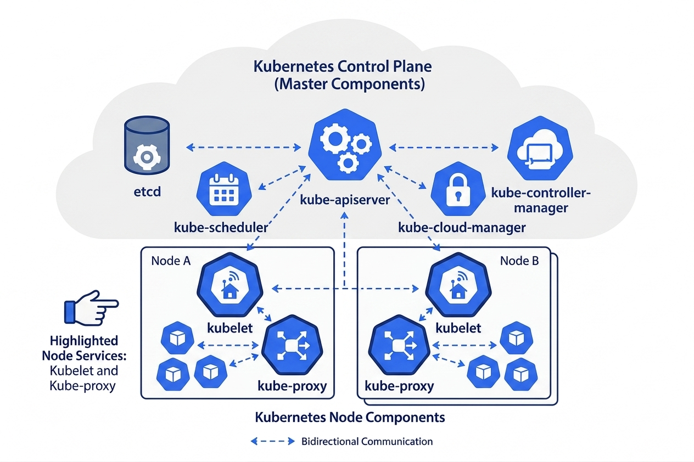
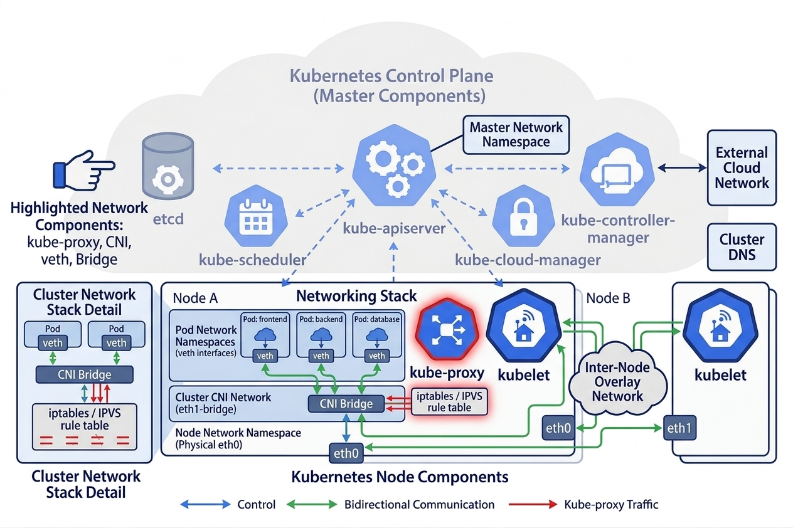
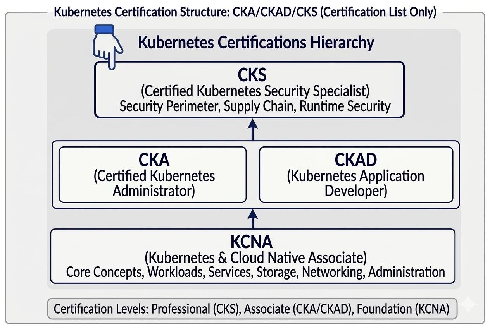

# Notes

-  :octicons-arrow-right-24: __[k8s Overview](k8s-basics.md)__
-  :octicons-arrow-right-24: __[k8s Deployment/Installation](./Deployment/index.md)__
-  :octicons-arrow-right-24: __[k8s Control plane](./k8s-controlplane.md)__
-  :octicons-arrow-right-24: __[k8s Worker nodes](./k8s-workernodes.md)__
-  :octicons-arrow-right-24: __[k8s Security: Secure Networking](./k8s-networking.md)__
-  :octicons-arrow-right-24: __[k8s Security: Secure workload](./k8s-security.md)__
-  :octicons-arrow-right-24: __[k8s Security: Secure containerization](secure-containerization.md)__
-  :octicons-arrow-right-24: __[k8s Security: Certs](k8s-security-certs.md)__

