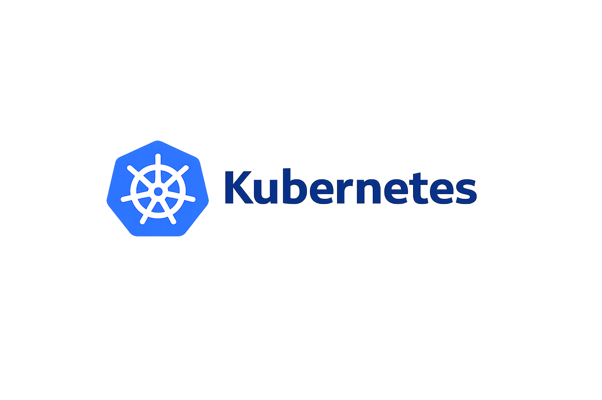
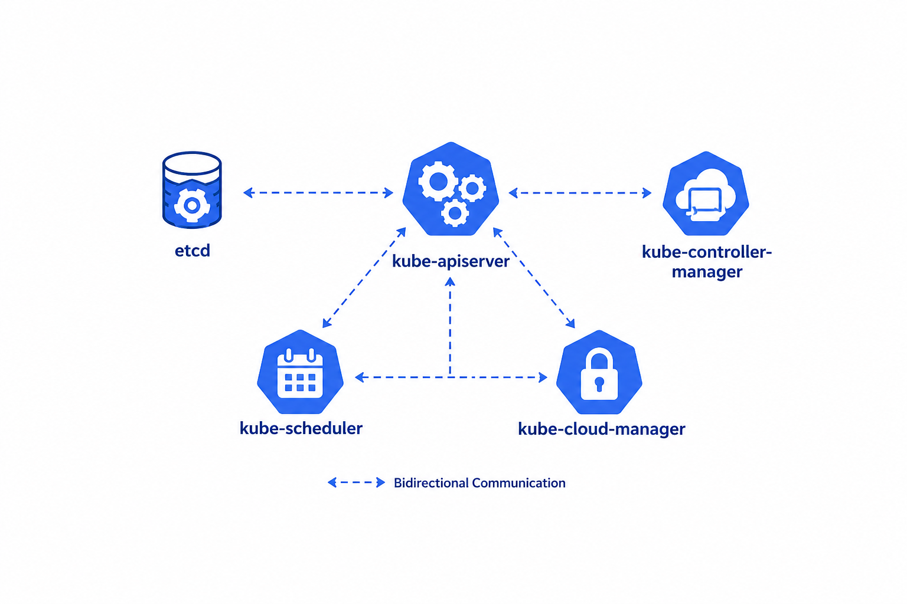
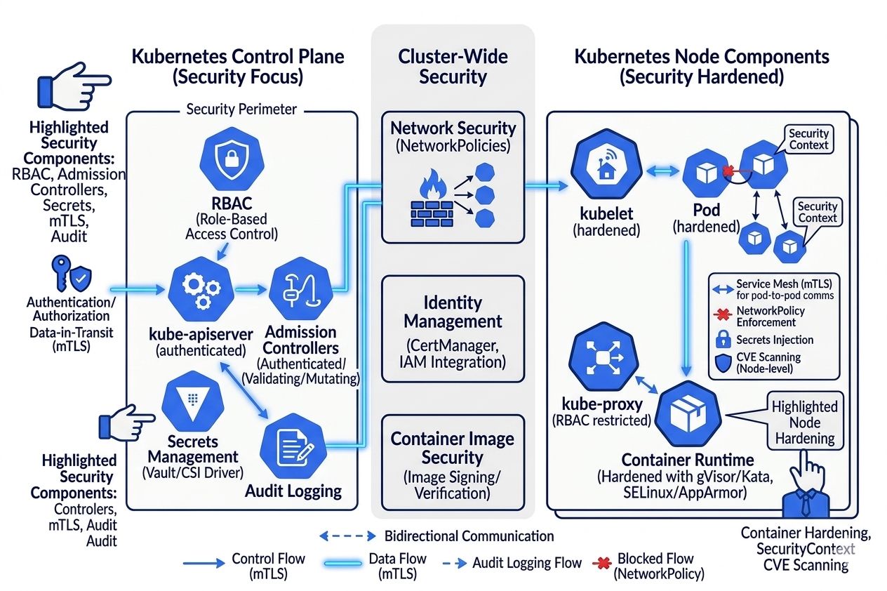

# Notes

*  :octicons-arrow-right-24: [**k8s Overview**](k8s-basics.md)
*  :octicons-arrow-right-24: [**k8s Deployment/Installation**](Deployment/index.md)
*  :octicons-arrow-right-24: [**k8s Control plane**](k8s-controlplane.md)
*  :octicons-arrow-right-24: [**k8s Worker nodes**](k8s-workernodes.md)
*  :octicons-arrow-right-24: [**k8s Security: Secure Networking**](k8s-networking.md)
*  :octicons-arrow-right-24: [**k8s Security: Secure workload**](k8s-security.md)
*  :octicons-arrow-right-24: [**k8s Security: Secure containerization**](https://github.com/canyakora1/playroom-cloud-security/blob/main/docs/Kubernetes/secure-containerization.md)
*  :octicons-arrow-right-24: [**k8s Security: Certs**](k8s-security-certs.md)
