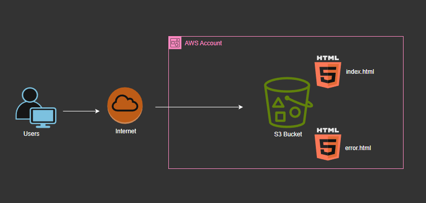

# Basic

## Featured Projects

Beautiful documentation starts with the content you create — and GitBook makes it easy to get started with any pre-existing content



<figure><figcaption></figcaption></figure>



#### Static websire deployment in AWS

This project walks you through the steps in deploying a static website in AWS.

<a href="https://app.gitbook.com/o/vj8nJX54hNZO8XFOMxCm/s/dA1F4fRL0iXbO3f46E3r/~/edit/~/changes/7/docs/aws/projects/index/basic/static-website-hosting" class="button primary">Read more</a>





#### Deploy a three (3) tier AWS Architecture

Deployinhg a 3 tier architecture in AWS is fundamental in architecting resiliant, highly available and secure AWS services.

<a href="https://app.gitbook.com/o/vj8nJX54hNZO8XFOMxCm/s/dA1F4fRL0iXbO3f46E3r/~/edit/~/changes/7/docs/aws/projects/index/basic/three-tier-architecture" class="button primary">Connect now</a>



<figure><figcaption></figcaption></figure>


