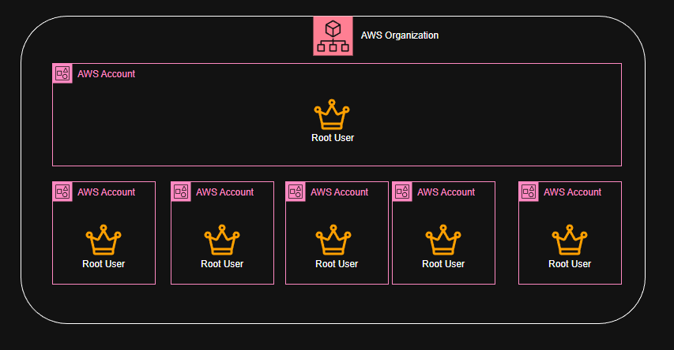

---
date:
  created: 2026-01-04
  updated: 2026-01-04
authors:
  - dcyberguy
  - playroom
---

# Centralize Root account for Organization member Accounts



AWS in 2025 released what Cloud security engineers call `"a more-secure solution for the root accounts"`. In a nut-shell, before now each AWS account that is part of an AWS Organization has a root account that are assigned to the account that has absolute control/access to all AWS services and resources in those account.

<!-- more -->

Now with this new release you can now combine all the AWS account in an AWS Organization to a central management that would be centrally controlled by a `delegate` root `supremo`. Once the consolidation is completed, a numbers of activities can be carried out such as:

- :fontawesome-solid-user-group: Deleting the root user credentials from other members accounts in the AWS Organization.
- :fontawesome-solid-user-group: Remove the root user's password, access keys.
- :fontawesome-solid-user-group: Deactivate their multi-factor authentication (MFA).

- :fontawesome-solid-user-group: New accounts that are added to the AWS Organization, wouldn't have a root user credentials by default.

## :simple-rundeck: Getting Started

To get started there are some prerequisites that __MUST__ be preconfigured before proceeding:

- You definitely should have an AWS Account. More than one AWS Account is preferred.
- Have an AWS Organization already configured.
- You must have the following IAM permissions:

```bash
  iam:GetAccessKeyLastUsed

  iam:GetAccountSummary

  iam:GetLoginProfile

  iam:GetUser

  iam:ListAccessKeys

  iam:ListMFADevices

  iam:ListSigningCertificates

  sts:AssumeRoot
```

- You must have the following permissions to enable this feature in your organization:

```bash
iam:EnableOrganizationsRootCredentialsManagement

iam:EnableOrganizationsRootSessions

iam:ListOrganizationsFeatures

organizations:EnableAwsServiceAccess

organizations:ListAccountsForParent

organizations:RegisterDelegatedAdministrator
```

To ensure optimal console functionality, we recommend enabling the following additional permissions:

```bash
organizations:DescribeAccount

organizations:DescribeOrganization

organizations:ListAWSServiceAccessForOrganization

organizations:ListDelegatedAdministrators

organizations:ListOrganizationalUnitsForParent

organizations:ListParents

organizations:ListTagsForResource
```

## :material-console: Using the Console:
Once you are at the IAM portion on the AWS Console
Enable `Centralized root access Management` by clicking `Enable`.


