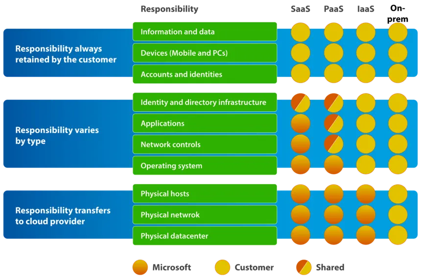
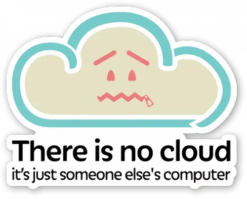

## Shared Responsibility Model

[azure-shared-responsibility-model](https://www.corestack.io/azure-security-tools/azure-shared-responsibility-model/)

Here's a more detailed breakdown of common responsibilities:

| Responsibility Area         | Cloud Service Provider (CSP)                                                                                                                                                                                             | Customer                                                                                                                                                                                                                                                                                                                                                                                                                                                                                    |
| :-------------------------- | :----------------------------------------------------------------------------------------------------------------------------------------------------------------------------------------------------------------------- | :------------------------------------------------------------------------------------------------------------------------------------------------------------------------------------------------------------------------------------------------------------------------------------------------------------------------------------------------------------------------------------------------------------------------------------------------------------------------------------------------- |
| **Physical Security** | Security of data centers, hardware, and the physical network infrastructure.                                                                                                                                             | N/A                                                                                                                                                                                                                                                                                                                                                                                                                                                                                                                               |
| **Infrastructure Security** | Security of the underlying compute, storage, and networking services.                                                                                                                                                 | Network configuration (e.g., security groups, network ACLs), operating system security (in IaaS), and firewall rules.                                                                                                                                                                                                                                                                                                                                                                                                                    |
| **Platform Security** | Security of the cloud platform and managed services (e.g., databases, serverless functions).                                                                                                                             | Configuration of platform services, securing application code, and managing access to these services.                                                                                                                                                                                                                                                                                                                                                                                                                                     |
| **Application Security** | Security of the services provided by the CSP (e.g., SaaS applications).                                                                                                                                                  | Security of applications deployed by the customer in the cloud (in IaaS and PaaS), including secure coding practices and vulnerability management.                                                                                                                                                                                                                                                                                                                                                                                           |
| **Data Security** | Physical security of the storage where customer data resides.                                                                                                                                                            | Encryption of data at rest and in transit, data classification, data loss prevention (DLP), and managing access to data.                                                                                                                                                                                                                                                                                                                                                                                                         |
| **Identity & Access Management** | Security of the CSP's authentication and authorization systems.                                                                                                                                                      | Managing user identities and access rights to cloud resources, implementing multi-factor authentication (MFA), and adhering to the principle of least privilege.                                                                                                                                                                                                                                                                                                                                                                 |
| **Compliance** | Compliance with industry regulations and standards for the cloud infrastructure.                                                                                                                                       | Achieving and maintaining compliance for the workloads and data the customer puts in the cloud, often requiring understanding the CSP's compliance certifications and implementing additional controls.                                                                                                                                                                                                                                                                                                                                          |

### Further readings:
- [AWS Shared Responsibility Model](https://aws.amazon.com/compliance/shared-responsibility-model/)
- [Shared responsibilities and shared fate on Google Cloud](https://cloud.google.com/architecture/framework/security/shared-responsibility-shared-fate)
- [Microsoft Learn: Shared responsibility in the cloud](https://learn.microsoft.com/en-us/azure/security/fundamentals/shared-responsibility)
