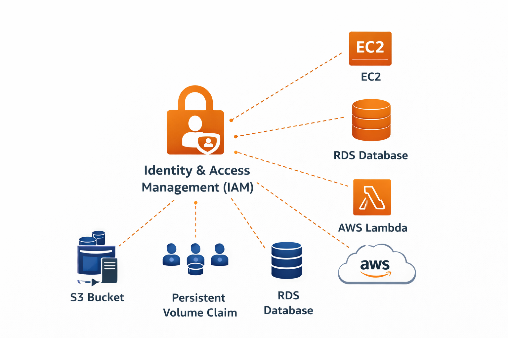
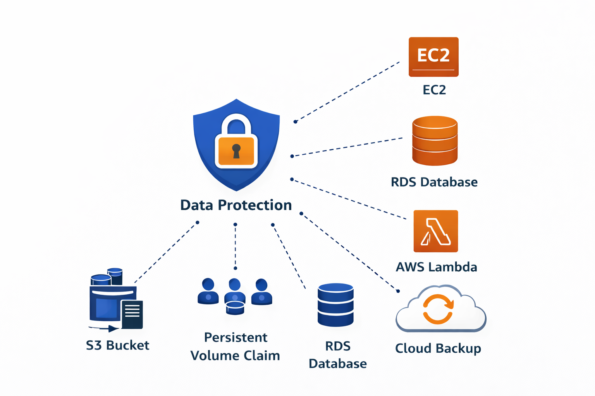
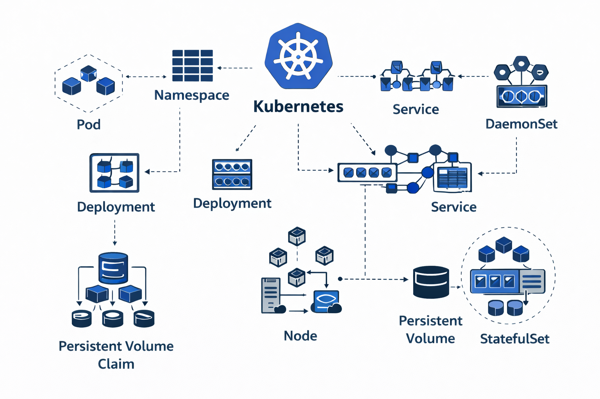
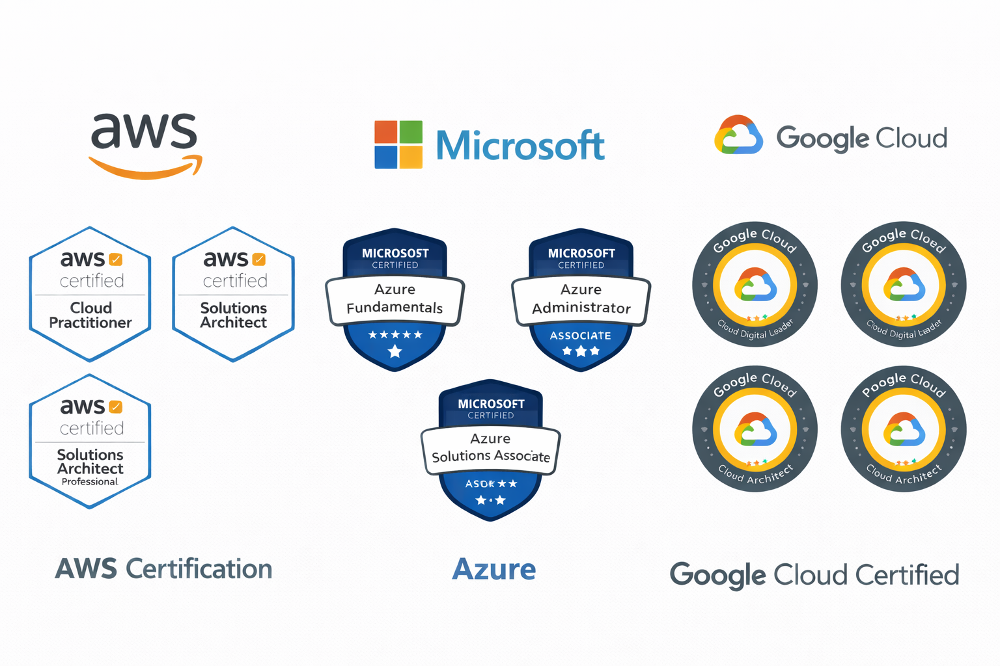

# Notes

*  :octicons-arrow-right-24: [**Cloud Security Roadmap: Cloud Basics**](cloud-basics.md)
*  :octicons-arrow-right-24: [**Cloud Security Roadmap: Governance, Risk & Compliance (Coming soon!!)**](cloud-compliance.md)
*  :octicons-arrow-right-24: [**Cloud Security Roadmap: Linux fundamentals**](linux-basics.md)
*  :octicons-arrow-right-24: [**Cloud Security Roadmap: IAM**](identity-access-management.md)
*  :octicons-arrow-right-24: [**Cloud Security Roadmap: Secure Networking**](secure-networking.md)
*  :octicons-arrow-right-24: [**Cloud Security Roadmap: Data Protection**](data-protection.md)
*  :octicons-arrow-right-24: [**Cloud Security Roadmap: Secure containerization**](secure-containerization.md)
*  :octicons-arrow-right-24: [**Cloud Security Roadmap: Certs**](cloud-security-certs.md)
